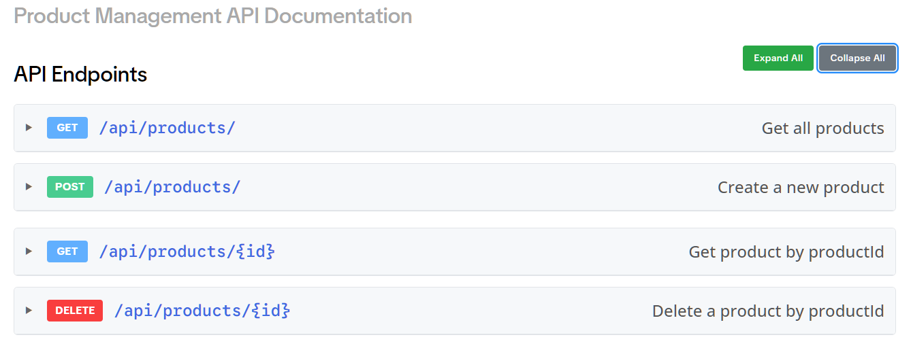
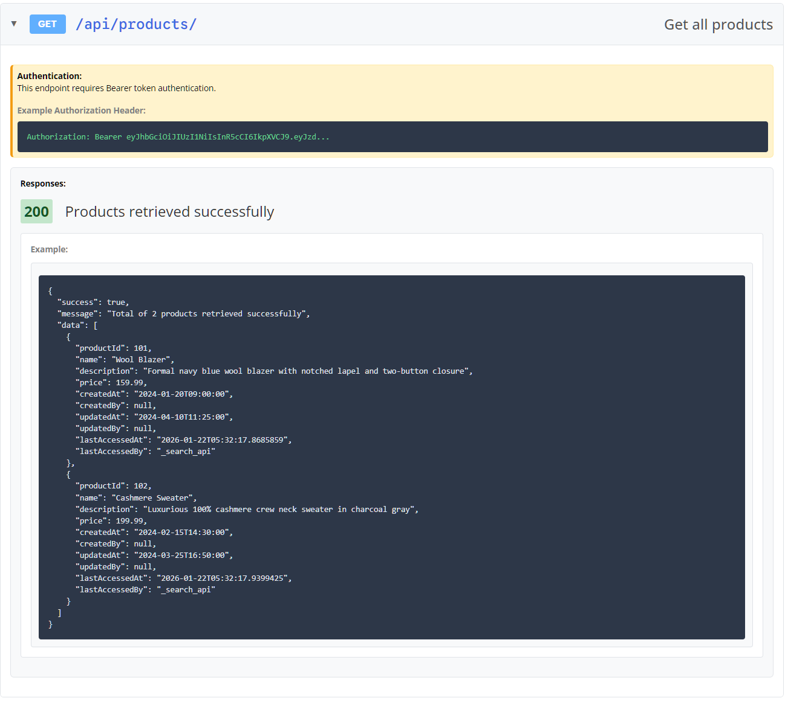
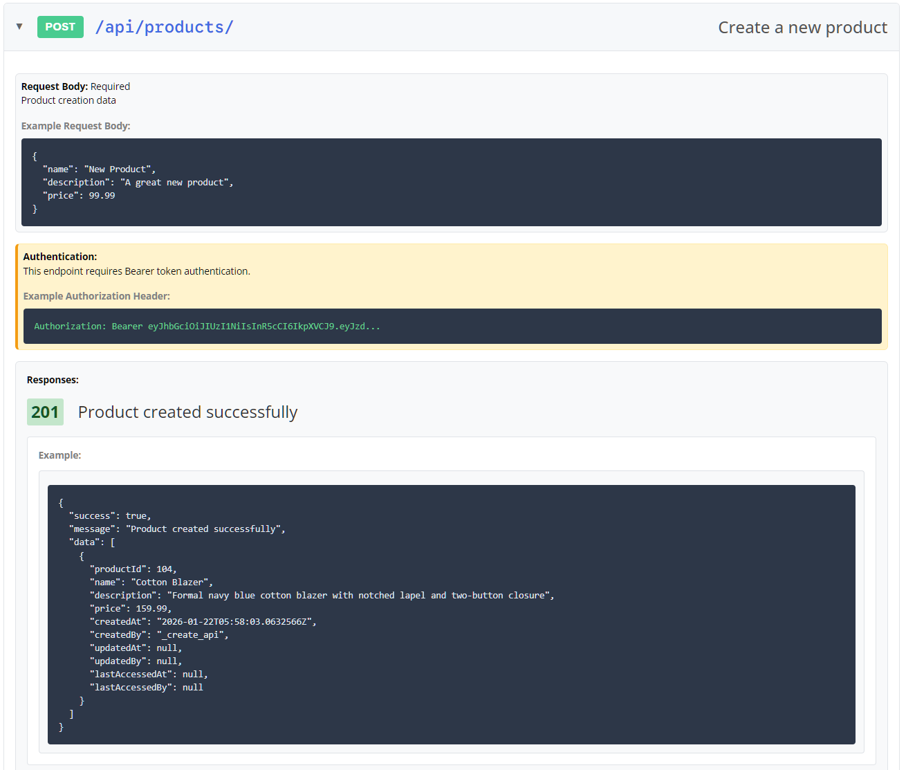
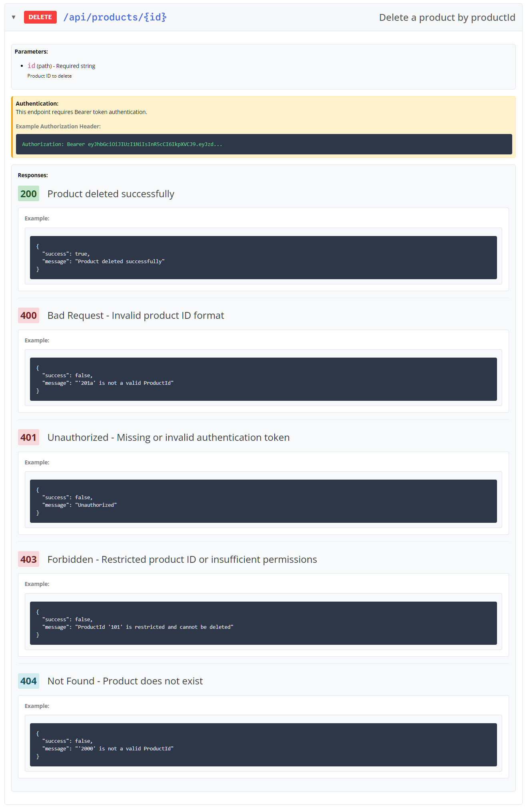

_AI - Deepseek was used in some parts of the codes. Those parts will have a comment about AI usage._


# Product Management API (with a database) - using ASP.NET
This is an API implementation using ASP.Net demonstrating API endpoints for basic product management.

Operations: 
- **creating/registering a new product** (Create using HTTP method `POST`),  
- **reading/searching for a product using the productId** (Retrieve using HTTP method `GET`), 
- **fetching all products** (Retrieve using HTTP method `GET`), 
- **deleting an account using the account Id** (Delete using HTTP method `DELETE`) 


## Requirements
<details>

- .NET SDK: Version 10.0.100
- SQL Lite for the database
- ANSI-capable terminal (optional, for colors)
- Modern browser
</details>

## Files and Folders
<details> 


```
Program_root
¦   .gitignore
¦   appsettings.Development.json
¦   appsettings.json
¦   dev_config.Development.json
¦   ProductManagement.csproj
¦   ProductManagement.slnx
¦   Controller.cs			        // Controller classes for available product APIs, authentication, and error handling
¦   dev_config.json			        // Configuration for database, JWT tokens, and default users. It should be substituted with production implementation
¦   ProductManagementEndpoints.cs	// Handles product Search, Create, and Delete endpoints
¦   Program.cs				        // Main program class for the API
¦   
+---AppBuilder
¦       AppBuilderController.cs		// Adds controller services to dependency injection
¦       AppBuilderExtensions.cs		// Extension method to configure Entity Framework SQLite DbContext
¦       AppBuilderRazor.cs		    // Extension method to configure Razor Pages services
¦       
+---Data				            // Data access layer
¦   ¦   ApplicationDbContext.cs		// Entity Framework DbContext for identity (future feature)
¦   ¦   
¦   +---Migrations			        // EF Core database migration files
¦           
+---Database
¦       product_management.db		// Database file containing the products

¦       
+---EntityModels			        // Autogenerated model for products - from EF tool
¦       Product.cs			        // Autogenerated model for products - from EF tool, customized with data annotations
¦       ProductManagementDb.cs		// Autogenerated model for products - from EF tool, revised to take connection string using another file
¦       
+---Helper
¦       ApplyMigrationsAsync.cs		// Extension method to apply EF Core migrations and configure SQLite
¦       Helper.cs			        // General helper for custom reponses and configuration 
¦       JsonHelper.cs			    // JSON helper ensuring the JSON is valid and return response when it's not
¦       
+---JwtAuth
¦       AuthEndpoints.cs		    // Static endpoints for JWT token generation and validation
¦       AuthModels.cs			    // Authentication models and interfaces (JWT settings, user, tokens)
¦       AuthService.cs			    // Authentication service with in-memory user validation
¦       ConfigAuthBuilder.cs		// Configures JWT authentication, authorization policies, and Identity services
¦       TokenService.cs			    // ITokenService implementation for JWT generation
¦       
+---Pages
¦   ¦   ApiDoc.cshtml			    // Customized API documentation (from static assets)
¦   ¦   ApiCoc.cshtml.cs
¦   ¦   DevToken.cshtml			    // Developer token page for testing purposes 
¦   ¦   DevToken.cshtml.cs
¦   ¦   Index.cshtml			    // Homepage 
¦   ¦   Index.cshtml.cs			    // Homepage
¦   ¦   _ViewImports.cshtml
¦   ¦   _ViewStart.cshtml
¦   ¦   
¦   +---Shared				        // Templates and shared pages 
¦           
+---Properties
¦       launchSettings.json
¦       
+---wwwroot
    ¦   favicon.ico
    ¦   
    +---css
    ¦       api-docs.css            // Styles for the api documentation 
    ¦       devtoken.css 		    // Styles for the dev token page 
    ¦       site.css
    ¦       
    +---doc_json
    ¦       swagger.json		    // data to generate the API documentaion 
    ¦       
    +---js
    ¦       readAndDisplay.js		// Script to generate the API documentation
    ¦       site.js
    ¦       
    +---lib				            // styling and js libraries from template 
         
```
</details>

## Build and Run (powershell)
<details>

- Restore dependencies 
	```
	dotnet restore
	```

- Build
	```
	dotnet build
	```

- Run
	```
	dotnet run
	```

</details>

## API Endpoints Documentation 

I have implemented a razor page for the documentation which looks like the screen shots below. 
It's accessible when the program runs using the {{url}}/apidocs (e.g. http://10.0.0.200:8090/apidocs). 
The custom razor/api docs page provides more details on the reponses especially for failures. 








